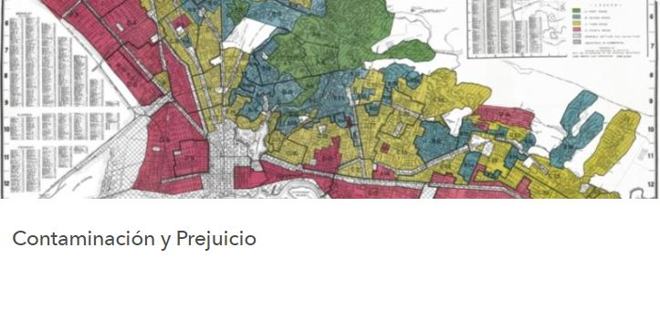

```{r redlining-fig, fig.align = 'center', out.width = "95%", echo=FALSE}
knitr::include_graphics(here::here("images", "holc-scan_snip.jpg"))
```

---

### *Linking past racist land use policies to current day environmental disparities*
Understanding the role of government in perpetuating institutional and structural racism is essential to our work at CalEPA. Redlining is a practice through which federal and local governments and financing entities systematically denied public and private financial services to Black and other people of color. This set of practices included both race **and** environmental factors as criteria in assessing the perceived credit-worthiness of neighborhoods and led to many of the environmental disparities we see affecting communities of color across the state today. 

CalEPA's racial equity team designed story maps to help agency staff and the public explore the connection between racist land use practices of the 1930s and the persistence of environmental injustice. Understanding how environmental conditions are informed by legacy land use practices only helps us better focus and refine our policy development and implementation, to ensure equitable access to clean air, water and land for all Californians. 

**Click on the images below** to access the Pollution & Prejudice story maps, both in English and Spanish:

[{width=45%}](https://storymaps.arcgis.com/stories/f167b251809c43778a2f9f040f43d2f5) [{width=45%}](https://pollution-and-prejudice-calrecycle.hub.arcgis.com/apps/5d0a652fa8c04a32b25236d672596b26/explore)

---

### *Community Outreach & Conversations*
CalEPA's Pollution & Prejudice team also hosted several state and nationally-attended webinars in 2021. One highlight was the webinar on August 18, 2021 where California and national environmental justice leaders joined staff from the Pollution and Prejudice team to share these stories and talk about the steps that are needed to confront the legacy of structural racism and environmental injustice. We invite you to check out this [video playlist](https://youtube.com/playlist?list=PLk3WcTNiWgg1Q_YUScGqTWCcDLodd0MdH) of the main session, breakout groups, and panel discussion. 
<!---A summary of the project can be found at [this website](calepa website that Jaimie, Kevin, and Jenn developed)--->


**We want to build on this data story** on multiple topics at multiple scales! For more information, see [Our Future](https://caleparacialequity.github.io/racial-equity-data-resources/OurFuture.html).