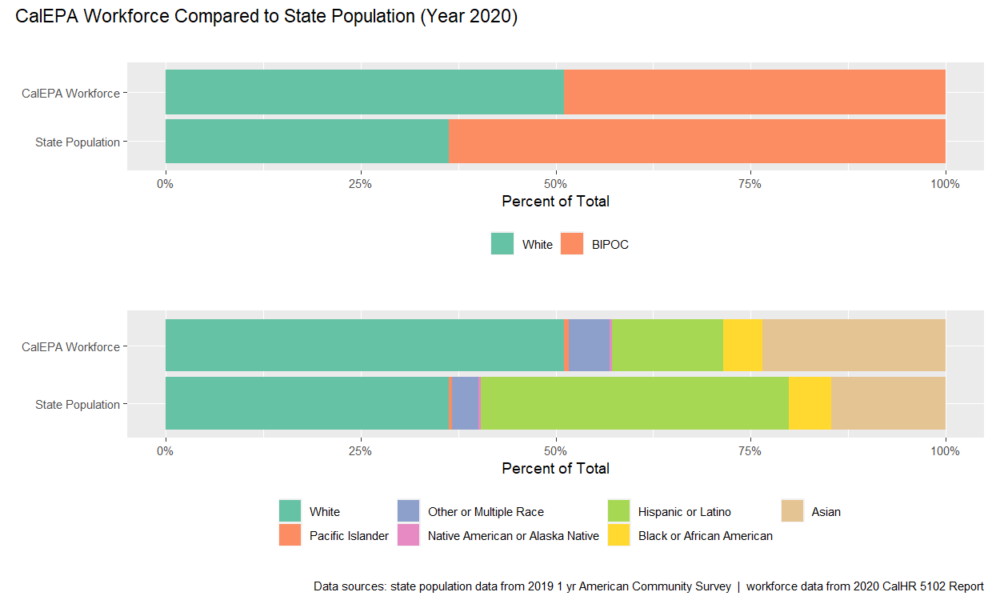

<html>
<style> 
.gallerySection, .formatSection {
  margin-bottom: 2em;
}

.gallerySection .gallerySectionTitle, .formatSection .formatSectionTitle {
  font-size: 25px;
  font-weight: 300;
}

.formatSection .formatSectionTitle {
  margin-bottom: 10px;
}

.gallerySection .galleryIntro {
  margin-bottom: 10px;
}

.gallerySection .galleryItems {
  display: flex;
  justify-content: space-between;
  align-items: flex-start;
  flex-wrap: wrap;
}

.gallerySection .galleryItems .galleryItem {
  width: 24%;

  border: 1px solid #f0f0f0;
  margin-bottom: 20px;
}

.gallerySection .galleryItems .galleryItem:hover {

}

.gallerySection .galleryItems .galleryItem .galleryItemLabel {
  display: block;
  cursor: pointer;
  border-top: 1px solid #f0f0f0;
  padding: 10px 10px 5px 10px;
}

.gallerySection .galleryItems .galleryItem .galleryItemImage {
  width: 100%;
  height: auto;
}

.gallerySection .galleryItems .galleryItem .galleryItemDescription {
  font-size: 12px;
  padding: 0px 10px 10px 10px;
}
</style>
</html>

This page is a catalog of data resources related to racial equity and environmental justice.
 

#  {.tabset .tabset-pills}

## All

## Workforce Equity
<html>
<div>These tools are specific to advancing equitable workforce recruitment and retention practices.</div>
  <div class="galleryItems">
    <div class="galleryItem">
      <a href="https://cawaterdatadive.shinyapps.io/Workforce-Demographics/"></a>
      <a href="https://cawaterdatadive.shinyapps.io/Workforce-Demographics/" class="galleryItemLabel">Workforce Data Visualization</a>
        <div class="galleryItemDescription">Developed by CalEPA Racial Equity Data Subteam.</div>
    </div>
  </div>
</html>
      
      <div class="galleryItem">
        <a href="https://github.com/svmiller/svm-r-markdown-templates/blob/master/article-example/svm-rmarkdown-article-example.pdf"></a>
        <a href="https://github.com/svmiller/svm-r-markdown-templates/blob/master/article-example/svm-rmarkdown-article-example.pdf" class="galleryItemLabel">PDF</a>
        <div class="galleryItemDescription">PDF documents for printing. <a href="https://github.com/svmiller/svm-r-markdown-templates/blob/master/article-example/svm-rmarkdown-article-example.Rmd">Example Code</a></div>
      </div>
      <div class="galleryItem">
        
        <a href="https://github.com/svmiller/svm-r-markdown-templates/tree/master/word-example" class="galleryItemLabel">Microsoft Word</a>
        <div class="galleryItemDescription">Microsoft Word documents for Office workflows.</div>
      </div>
      <div class="galleryItem">
        <a href="https://rstudio.github.io/tufte/"></a>
        <a href="https://rstudio.github.io/tufte/" class="galleryItemLabel">Handouts</a>
        <div class="galleryItemDescription">Tufte styled documents for handouts. <a href="https://github.com/rstudio/tufte/tree/master/inst/rmarkdown/templates/tufte_html/skeleton/skeleton.Rmd">Example Code</a></div>
      </div>
    </div>
  </div>

## Pollution Burden

## Language Access

```{=html}
<!---## Trash Datathon Resources
This page provides links to efforts around the state and beyond to better understand and respond to the problem of trash pollution through:

- improved data collection methods/tools and data standards
- assessment and characterization of trash data to improve our understanding of the magnitude, distribition, and content of trash pollution (e.g., the magnitude and distribution of trash pollution across space and time, types of trash pollution and their relative magnitudes, etc.) 
- Use of trash data to analyze and/or predict the effects of trash pollution on environmental and public health--->
```
### 1930s HOLC 'Redlining' Maps

-   [University of Richmond's Mapping Inequality Project](http://dsl.richmond.edu/panorama/redlining/#text=downloads)
-   [CalEPA Pollution & Prejudice Analysis](https://github.com/daltare/Redline-Mapping/tree/master/data_processed-analysis)
    -   This site includes geospatial datasets developed using a combination of the data from the University of Richmond's *Mapping Inequality* project, as well as the CalEPA's CalEnviroScreen 3.0 dataset.

### CalEnviroScreen 3.0

-   [CalEnviroScreen 3.0 Shapefile](https://oehha.ca.gov/media/downloads/calenviroscreen/document/ces3shp.zip)

### CalEPA Racial Equity Projects

-   [CalEPA Redline Data Analysis Tool](https://cawaterdatadive.shinyapps.io/Redline-CES-Analysis/)
-   [CalEPA Workforce Tool](https://bit.ly/calepa2019)
-   [CalEPA Linguistic Isolation Tool](https://bit.ly/ling_isol_viz)

<!-- </div> -->

<!-- <div class="col-sm-6"> -->

<!--  -->
