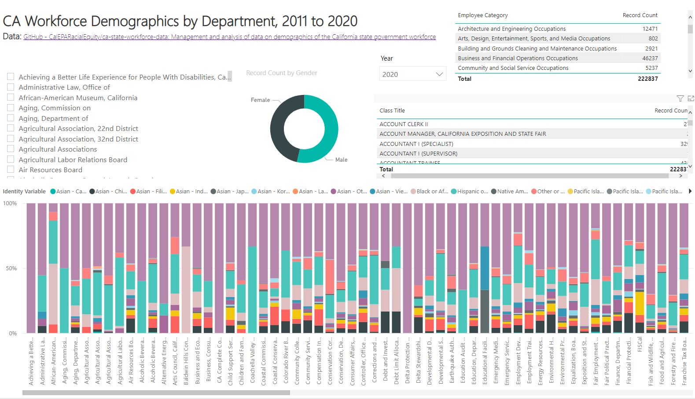

```{r setup, include = FALSE}
knitr::opts_chunk$set(echo = TRUE)
```

```{css, echo = FALSE}
.gallerySection, .formatSection {
  margin-bottom: 2em;
}

.gallerySection .gallerySectionTitle, .formatSection .formatSectionTitle {
  font-size: 25px;
  font-weight: 300;
}

.formatSection .formatSectionTitle {
  margin-bottom: 10px;
}

.gallerySection .galleryIntro {
  margin-bottom: 10px;
}

.gallerySection .galleryItems {
  display: flex;
  justify-content: space-between;
  align-items: flex-start;
  flex-wrap: wrap;
}

.gallerySection .galleryItems .galleryItem {
  width: 24%;

  border: 1px solid #f0f0f0;
  margin-bottom: 20px;
}

.gallerySection .galleryItems .galleryItem:hover {

}

.gallerySection .galleryItems .galleryItem .galleryItemLabel {
  display: block;
  cursor: pointer;
  border-top: 1px solid #f0f0f0;
  padding: 10px 10px 5px 10px;
}

.gallerySection .galleryItems .galleryItem .galleryItemImage {
  width: 100%;
  height: auto;
}

.gallerySection .galleryItems .galleryItem .galleryItemDescription {
  font-size: 12px;
  padding: 0px 10px 10px 10px;
}
```

This page is a catalog of data resources related to racial equity and environmental justice.

# {.tabset .tabset-pills}

## Workforce Equity

<!--html_preserve-->
<div>These tools are specific to advancing equitable workforce recruitment and retention practices.</div>
  <p>
  <div class="gallerySection">
    
    <div class="galleryItems">
    
      <div class="galleryItem">
        <a href="https://github.com/CalEPARacialEquity/ca-state-workforce-data "></a>
        <a href="https://github.com/CalEPARacialEquity/ca-state-workforce-data " class="galleryItemLabel">Workforce GitHub Repository</a>
        <div class="galleryItemDescription">Build your own departmental workforce report.</div>
      </div>
      
      <div class="galleryItem">
        <a href="https://app.powerbigov.us/view?r=eyJrIjoiN2FjODBmYjItYWEwYy00ZmQ2LWJlOGYtZDc2YmU5ZmRkMjI3IiwidCI6ImZlMTg2YTI1LTdkNDktNDFlNi05OTQxLTA1ZDIyODFkMzZjMSJ9"></a>
        <a href="https://app.powerbigov.us/view?r=eyJrIjoiN2FjODBmYjItYWEwYy00ZmQ2LWJlOGYtZDc2YmU5ZmRkMjI3IiwidCI6ImZlMTg2YTI1LTdkNDktNDFlNi05OTQxLTA1ZDIyODFkMzZjMSJ9" class="galleryItemLabel">Power BI Workforce Data Visualization</a>
        <div class="galleryItemDescription">Interactive web application to visualize demographics for your department.</div>
      </div>
      
      <div class="galleryItem">
        <a href="https://cawaterdatadive.shinyapps.io/Workforce-Demographics/"></a>
        <a href="https://cawaterdatadive.shinyapps.io/Workforce-Demographics/" class="galleryItemLabel">R Shiny Workforce Data Visualization</a>
        <div class="galleryItemDescription">Interactive web application to visualize demographics for your department.</div>
      </div>
      
      <div class="galleryItem">
        <a href="https://data.ca.gov/dataset/calhr-civil-rights-data-for-gare-capital-cohort-2019"></a>
        <a href="https://data.ca.gov/dataset/calhr-civil-rights-data-for-gare-capital-cohort-2019" class="galleryItemLabel">CalHR 5102 and 5112 Reports</a>
        <div class="galleryItemDescription">State of California workforce data in machine readable structure.</div>
      </div>
      
   </div>

  </div>
<!--/html_preserve-->

## Pollution Burden
<!--html_preserve-->
<div>These tools are specific to advancing equitable workforce recruitment and retention practices.</div>
  <p>
  <div class="gallerySection">
    
    <div class="galleryItems">
    
      <div class="galleryItem">
        <a href="https://github.com/CalEPARacialEquity/ca-state-workforce-data "></a>
        <a href="https://github.com/CalEPARacialEquity/ca-state-workforce-data " class="galleryItemLabel">Workforce GitHub Repository</a>
        <div class="galleryItemDescription">Build your own departmental workforce report.</div>
      </div>
      
      <div class="galleryItem">
        <a href="https://app.powerbigov.us/view?r=eyJrIjoiN2FjODBmYjItYWEwYy00ZmQ2LWJlOGYtZDc2YmU5ZmRkMjI3IiwidCI6ImZlMTg2YTI1LTdkNDktNDFlNi05OTQxLTA1ZDIyODFkMzZjMSJ9"></a>
        <a href="https://app.powerbigov.us/view?r=eyJrIjoiN2FjODBmYjItYWEwYy00ZmQ2LWJlOGYtZDc2YmU5ZmRkMjI3IiwidCI6ImZlMTg2YTI1LTdkNDktNDFlNi05OTQxLTA1ZDIyODFkMzZjMSJ9" class="galleryItemLabel">Power BI Workforce Data Visualization</a>
        <div class="galleryItemDescription">Interactive web application to visualize demographics for your department.</div>
      </div>
      
      <div class="galleryItem">
        <a href="https://cawaterdatadive.shinyapps.io/Workforce-Demographics/"></a>
        <a href="https://cawaterdatadive.shinyapps.io/Workforce-Demographics/" class="galleryItemLabel">R Shiny Workforce Data Visualization</a>
        <div class="galleryItemDescription">Interactive web application to visualize demographics for your department.</div>
      </div>
      
      <div class="galleryItem">
        <a href="https://data.ca.gov/dataset/calhr-civil-rights-data-for-gare-capital-cohort-2019"></a>
        <a href="https://data.ca.gov/dataset/calhr-civil-rights-data-for-gare-capital-cohort-2019" class="galleryItemLabel">CalHR 5102 and 5112 Reports</a>
        <div class="galleryItemDescription">State of California workforce data in machine readable structure.</div>
      </div>
      
   </div>

  </div>
<!--/html_preserve-->

## Language Access
<!--html_preserve-->
<div>These tools are specific to advancing equitable workforce recruitment and retention practices.</div>
  <p>
  <div class="gallerySection">
    
    <div class="galleryItems">
    
      <div class="galleryItem">
        <a href="https://github.com/CalEPARacialEquity/ca-state-workforce-data "></a>
        <a href="https://github.com/CalEPARacialEquity/ca-state-workforce-data " class="galleryItemLabel">Workforce GitHub Repository</a>
        <div class="galleryItemDescription">Build your own departmental workforce report.</div>
      </div>
      
      <div class="galleryItem">
        <a href="https://app.powerbigov.us/view?r=eyJrIjoiN2FjODBmYjItYWEwYy00ZmQ2LWJlOGYtZDc2YmU5ZmRkMjI3IiwidCI6ImZlMTg2YTI1LTdkNDktNDFlNi05OTQxLTA1ZDIyODFkMzZjMSJ9"></a>
        <a href="https://app.powerbigov.us/view?r=eyJrIjoiN2FjODBmYjItYWEwYy00ZmQ2LWJlOGYtZDc2YmU5ZmRkMjI3IiwidCI6ImZlMTg2YTI1LTdkNDktNDFlNi05OTQxLTA1ZDIyODFkMzZjMSJ9" class="galleryItemLabel">Power BI Workforce Data Visualization</a>
        <div class="galleryItemDescription">Interactive web application to visualize demographics for your department.</div>
      </div>
      
      <div class="galleryItem">
        <a href="https://cawaterdatadive.shinyapps.io/Workforce-Demographics/"></a>
        <a href="https://cawaterdatadive.shinyapps.io/Workforce-Demographics/" class="galleryItemLabel">R Shiny Workforce Data Visualization</a>
        <div class="galleryItemDescription">Interactive web application to visualize demographics for your department.</div>
      </div>
      
      <div class="galleryItem">
        <a href="https://data.ca.gov/dataset/calhr-civil-rights-data-for-gare-capital-cohort-2019"></a>
        <a href="https://data.ca.gov/dataset/calhr-civil-rights-data-for-gare-capital-cohort-2019" class="galleryItemLabel">CalHR 5102 and 5112 Reports</a>
        <div class="galleryItemDescription">State of California workforce data in machine readable structure.</div>
      </div>
      
   </div>

  </div>
<!--/html_preserve-->


<!-- </div> -->

<!-- <div class="col-sm-6"> -->

<!--  -->
