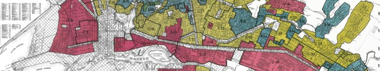

<!---## Trash Datathon Resources
This page provides links to efforts around the state and beyond to better understand and respond to the problem of trash pollution through:

- improved data collection methods/tools and data standards
- assessment and characterization of trash data to improve our understanding of the magnitude, distribition, and content of trash pollution (e.g., the magnitude and distribution of trash pollution across space and time, types of trash pollution and their relative magnitudes, etc.) 
- Use of trash data to analyze and/or predict the effects of trash pollution on environmental and public health--->

This page is a catalog of datasets related to racial equity and environmental justice.

### 1930s HOLC 'Redlining' Maps
- [University of Richmond's Mapping Inequlity Project](http://dsl.richmond.edu/panorama/redlining/#text=downloads)
- [CalEPA Redline-CalEnviroScreen Analysis](https://github.com/daltare/Redline-Mapping/tree/master/data_processed-analysis) 
    - This site includes geospatial datasets developed using a combination of the data from the University of Richmond's *Mapping Inequality* project, as well as the CalEPA's CalEnviroScreen 3.0 dataset (more description needed here, and maybe links to individual files w/ descriptions...)

### CalEnviroScreen 3.0
- [CalEnviroScreen 3.0 Shapefile](https://oehha.ca.gov/media/downloads/calenviroscreen/document/ces3shp.zip)

### Placeholder
- Placeholder

### Placeholder
- Placeholder

<!-- 
 -->
<!-- 
 -->

<!--  -->